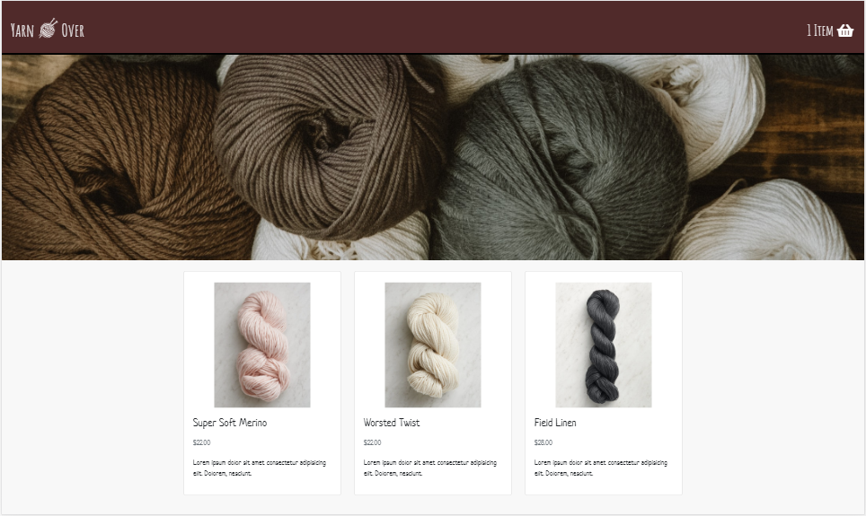
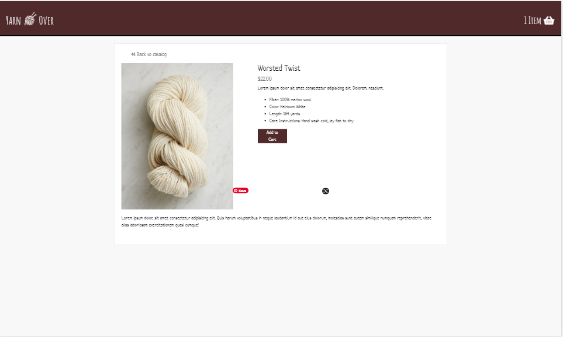
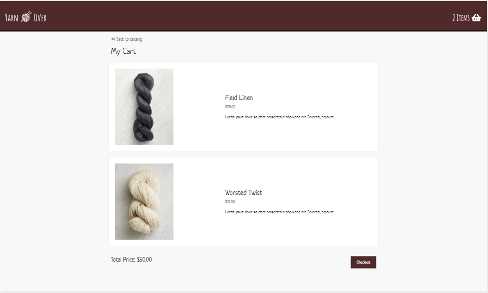
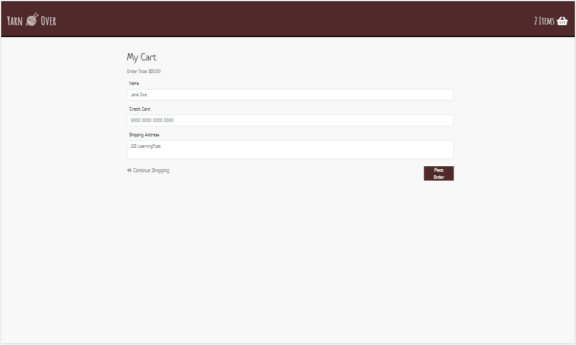

# Yarn Over
A full stack Node.js and React shopping cart app for yarn supplies.

## Live Link

## Technologies Used
 + React.js
 + Node.js
 + Express
 + PostgreSQL
 + Bootstrap 4
 + HTML5
 + CSS 3
 + AWS EC2

## Features
+ User can view a list of catalog items
+ User can view details of a product
+ User can add the product to their cart
+ User can review the items in their cart and total
+ User can place an order

## Preview





## Getting Started
1. Clone the repository
```
git clone https://github.com/Victoria-Corona/yarn-over
```
2. Navigate to the directory
```
cd yarn-over
```
3. Install all dependencies with `npm install`
4. Import the existing database with `npm run db:import`
5. Run the project with `npm run dev`
